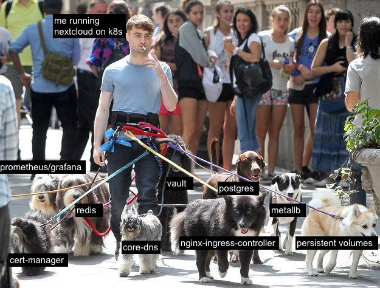

### Hoi friends 💙

```yaml
---
core_info:
  pronouns: 'he/him'
  resume_website: 'https://jessebot.work'
  gitlab: 'https://gitlab.com/jessebot'
  linkedin: Not currently accepting job offers
  
favorites:
  food: ['black sesame coconut ice cream', 'falafel', 'hummus', 'saag tofu/veggie kofta']
  projects: ['onboardme', 'smol_k8s_homelab', 'argocd', 'k8up']
```

Feel free to reach out! I am extremely active on GitLab and GitHub as I really care about not only documenting my work, but making it available for use for others in the future. I fix minor bugs and documentation issues in external open source repos, but the two most often updated documentation websites I maintain are currently:

|Site|Why|
|:---:|:---|
| [smol_k8s_homelab](https://jessebot.github.io/smol_k8s_homelab/) | Docs for everything I know about k8s that I want others to know as well |
| [onboardme](https://jessebot.github.io/onboardme) | Docs for everything I know about desktops and android |


Right now, I'm playing with Nextcloud and so this is a pretty good desciption of what I'm up to:

